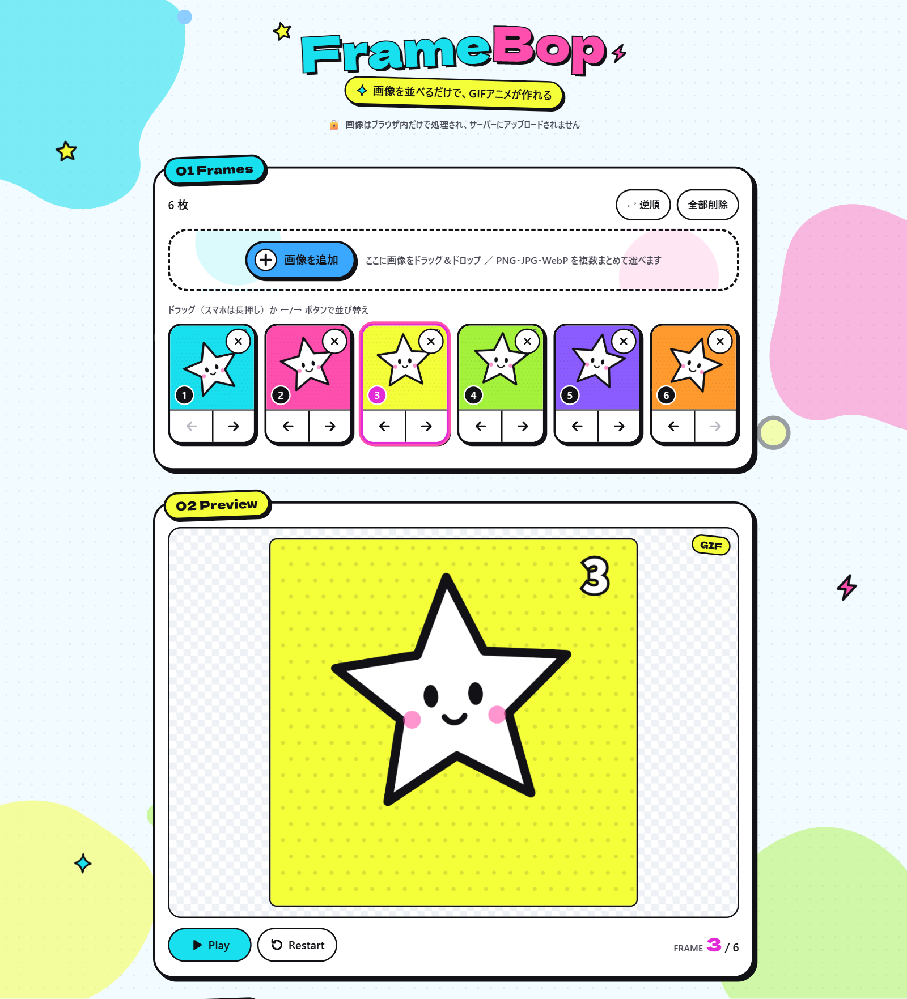
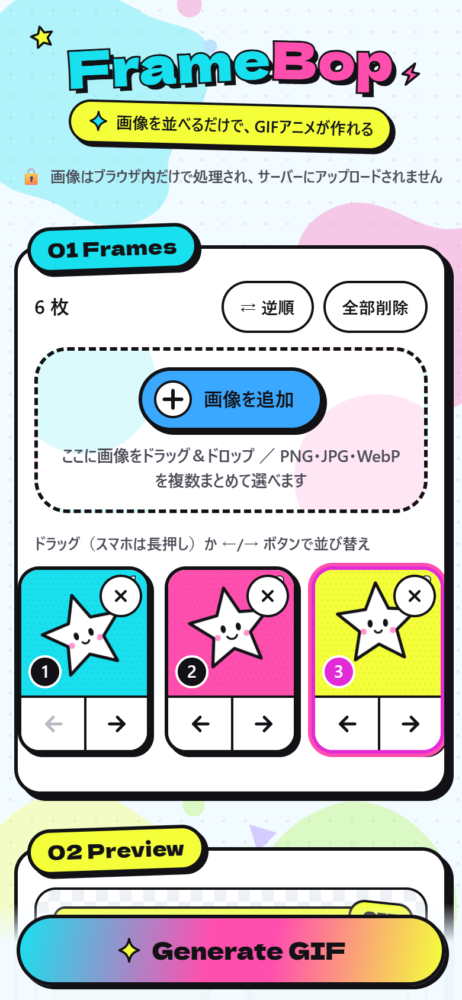

# FrameBop

**Make GIF animations from your images — right in your browser.**
画像を並べるだけで GIF アニメが作れる、スマホ対応のブラウザツールです。

**▶ Try it: https://momoco3.github.io/framebop/**

> 🔒 **Uploaded images are processed locally in your browser and are not uploaded to a server.**
> 読み込んだ画像はすべてお使いのブラウザの中だけで処理され、サーバーには一切送信されません。

<table>
  <tr>
    <td width="70%"></td>
    <td width="30%"></td>
  </tr>
  <tr>
    <td align="center">PC</td>
    <td align="center">スマホ（下に Generate ボタンが固定）</td>
  </tr>
</table>

---

## こんな人向け

- イラストレーター・デザイナー
- SNS（特に X）に GIF を投稿したい人
- コードを書かない人

PC でもスマホ（iPhone / Android）でも使えます。
X でよく見る「高速で切り替わる GIF をタップして止める遊び」用の GIF も手軽に作れます。

## 主な機能

| 機能 | 内容 |
| --- | --- |
| 画像の読み込み | ドラッグ＆ドロップ / ファイル選択 / スマホの写真選択（複数可）。PNG・JPG・WebP |
| 並び替え | ドラッグ（スマホは長押し）、または各フレームの ← / → ボタン。キーボード操作にも対応 |
| 表示時間 | 0.03〜1.00 秒のプリセット＋任意の秒数（0.01 秒単位） |
| 再生方法 | Loop（ON で無限ループ / OFF で 1 回再生）× Normal / Ping-Pong / Random |
| プリセット | X Tap Stop / Fast Shuffle / Smooth Animation / Slow Slideshow |
| プレビュー | Play / Pause / Restart、現在のフレーム番号表示。設定の変更が即座に反映 |
| 書き出し | **GIF**（メイン）/ アニメーション WebP / MP4 |
| 品質設定 | Resolution（Original / 1080 / 720 / 480px・長辺基準）、Quality（High / Medium / Small File） |
| 事前情報 | 推定ファイルサイズ・画像サイズ・フレーム数・FPS 相当・1 周の長さ |
| 保存 | ダウンロード。対応スマホでは共有メニュー（写真に保存・X アプリへ送る） |

### 再生方法のしくみ

- **Normal** … 1 → 2 → 3 → 4
- **Ping-Pong** … 1 → 2 → 3 → 4 → 3 → 2（ループ時。1 回再生のときは最後に 1 まで戻る）
- **Random** … 書き出し時に固定されたランダム順（「シャッフルし直す」で別の順番に）

プレビューと書き出しは同じ「タイムライン」を使うので、プレビューで見た順番・速さのまま書き出されます。

### プリセットの初期値

| プリセット | 表示時間 | Loop | 並び |
| --- | --- | --- | --- |
| X Tap Stop | 0.08 秒 | ON | Normal |
| Fast Shuffle | 0.05 秒 | ON | Random |
| Smooth Animation | 0.10 秒 | ON | Normal |
| Slow Slideshow | 0.50 秒 | ON | Normal |

## 使い方

1. **01 Frames** の「画像を選ぶ」をタップ（PC ならドラッグ＆ドロップでも OK）
2. サムネイルをドラッグ、または ← / → ボタンで順番を調整
3. **02 Preview** で動きを確認
4. **03 Preset** から用途を選ぶ（または 04 / 05 で細かく設定）
5. **06 Output** で形式・サイズ・画質を選び、推定サイズを確認
6. **07 Export** の「Generate GIF」を押す → 「Download」または「共有 / 保存」

> 💡 出力サイズの縦横比は **1 枚目の画像** に合わせます。縦横比が違う画像は「Fit」で「全体（余白あり）」か「切り抜き」を選べます。
> 💡 X の GIF は 15MB までが目安です。推定サイズが大きいときは Resolution や Quality を下げてください。

### ブラウザ対応

| 形式 | Chrome / Edge | Firefox | Safari (iPhone / Mac) |
| --- | --- | --- | --- |
| GIF | ✅ | ✅ | ✅ |
| WebP | ✅ | ✅ | ❌（ブラウザが WebP 書き出し非対応のためボタンが無効になります） |
| MP4 | ✅ | ✅（新しい版） | ✅（16.4 以降） |

iPhone で HEIC 形式の写真を選んだ場合は、写真選択画面が自動で JPEG に変換して渡してくれます。

---

## ローカルで動かす

事前に [Node.js](https://nodejs.org/)（v20 以上。推奨は v22）をインストールしてください。

```bash
npm install
```

```bash
npm run dev
```

表示された `http://localhost:5173` をブラウザで開きます。
同じ Wi-Fi のスマホから確認したいときは `npm run dev -- --host` で起動し、表示される `Network:` の URL をスマホで開いてください。

### ビルド（公開用ファイルの作成）

```bash
npm run build
```

`dist/` フォルダに公開用のファイルができます。`npm run preview` でビルド結果を確認できます。

## 公開する

### GitHub Pages

1. このフォルダを GitHub の Public リポジトリに push します（ブランチ名は `main`）
2. GitHub のリポジトリ画面で **Settings → Pages → Build and deployment → Source** を **GitHub Actions** にします
3. 以降は `main` に push するたびに `.github/workflows/deploy.yml` が自動でビルド・公開します
4. 公開 URL: `https://<ユーザー名>.github.io/<リポジトリ名>/`

`vite.config.ts` で `base: './'` にしているので、リポジトリ名に関係なくそのまま動きます。

### Vercel

1. [Vercel](https://vercel.com/) で「Add New… → Project」から GitHub リポジトリを選ぶ
2. Framework Preset は **Vite** が自動で選ばれます（Build Command: `npm run build` / Output Directory: `dist`）
3. 「Deploy」を押すだけで公開されます

どちらもサーバー側の処理は一切なく、静的ファイルを配信するだけです。

---

## どこを編集すればいい？

| やりたいこと | 編集するファイル |
| --- | --- |
| 色を変えたい | `src/index.css` の `:root`（`--cyan` `--pink` など） |
| プリセットを追加・変更したい | `src/presets.ts` の `PRESETS` |
| 表示時間の候補を変えたい | `src/presets.ts` の `DURATION_PRESETS_MS` |
| 最初に選ばれている設定を変えたい | `src/presets.ts` の `DEFAULT_SETTINGS` |
| 画質（色数・圧縮率）を調整したい | `src/lib/quality.ts` |
| 画面の並び順や見出しを変えたい | `src/App.tsx` |
| 各エリアの見た目を変えたい | `src/components/〇〇.module.css`（同じ名前の `.tsx` とセット） |

### ファイル構成

```
framebop/
├─ index.html                  … ページの入り口（タイトルなど）
├─ vite.config.ts              … ビルド設定
├─ public/favicon.svg          … タブのアイコン
├─ docs/                       … README 用スクリーンショット（差し替え方は docs/README.md）
├─ .github/workflows/deploy.yml … GitHub Pages 自動公開
└─ src/
   ├─ main.tsx                 … アプリの起動
   ├─ App.tsx                  … 画面全体の構成と状態管理
   ├─ App.module.css
   ├─ index.css                … 色・フォントなど全体のスタイル
   ├─ types.ts                 … データの形（Frame, Settings など）
   ├─ presets.ts               … プリセット・初期設定
   ├─ gifenc.d.ts              … gifenc ライブラリの型定義
   ├─ components/              … 画面の部品
   │  ├─ Header.tsx            … ロゴ・キャッチコピー
   │  ├─ DropZone.tsx          … 画像の読み込みエリア
   │  ├─ FrameStrip.tsx        … サムネイル一覧・並び替え・削除
   │  ├─ PreviewPlayer.tsx     … プレビュー再生
   │  ├─ PresetPicker.tsx      … プリセット選択
   │  ├─ DurationPicker.tsx    … 表示時間
   │  ├─ PlaybackOptions.tsx   … Loop / 再生順
   │  ├─ OutputSettings.tsx    … 形式・サイズ・画質・推定サイズ
   │  ├─ ExportPanel.tsx       … 生成ボタン・保存・共有
   │  ├─ Panel.tsx             … 白いカード＋ステッカー見出し（共通）
   │  ├─ Controls.tsx          … 選択ボタン・ON/OFF スイッチ（共通）
   │  └─ Stickers.tsx          … 星・稲妻などの飾りアイコン
   ├─ lib/                     … 画像処理のロジック
   │  ├─ loadImages.ts         … 画像ファイルの読み込み
   │  ├─ timeline.ts           … 再生順（Normal / Ping-Pong / Random）と表示時間
   │  ├─ drawFrame.ts          … 出力サイズの計算・1 フレームの描画
   │  ├─ quality.ts            … 画質プリセットの中身
   │  ├─ estimate.ts           … 推定ファイルサイズ
   │  ├─ encodeGif.ts          … GIF 書き出し
   │  ├─ encodeWebp.ts         … アニメーション WebP 書き出し
   │  ├─ encodeMp4.ts          … MP4 書き出し
   │  └─ download.ts           … ダウンロード・共有
   └─ workers/
      └─ gifWorker.ts          … GIF の圧縮処理（画面が固まらないよう別スレッドで実行）
```

> 将来「フレームごとに表示時間を変える」機能を付けるときは、`Frame` 型の `durationMs` に値を入れるだけで、プレビュー・書き出しすべてに反映されるようになっています（`src/lib/timeline.ts`）。

---

## 利用ライブラリとライセンス

### アプリに含まれるもの（ブラウザに配信されるコード）

| パッケージ | 用途 | ライセンス |
| --- | --- | --- |
| [react](https://github.com/facebook/react) / react-dom | 画面の構築 | MIT |
| scheduler（react の依存） | React 内部の処理順制御 | MIT |
| [gifenc](https://github.com/mattdesl/gifenc) | GIF エンコード（減色・LZW 圧縮） | MIT |
| [@dnd-kit/core](https://github.com/clauderic/dnd-kit) / @dnd-kit/sortable / @dnd-kit/utilities | フレームのドラッグ並び替え（マウス・タッチ・キーボード） | MIT |
| @dnd-kit/accessibility（dnd-kit の依存） | 並び替えの読み上げ対応 | MIT |
| tslib（dnd-kit の依存） | TypeScript の補助関数 | 0BSD |
| [mp4-muxer](https://github.com/Vanilagy/mp4-muxer) | MP4 ファイルの組み立て | MIT |
| @types/dom-webcodecs, @types/wicg-file-system-access（mp4-muxer の依存） | 型定義のみ（実行コードなし） | MIT |
| [@fontsource/dela-gothic-one](https://fontsource.org/fonts/dela-gothic-one) | 見出し用フォント「Dela Gothic One」（英字のみ読み込み） | OFL-1.1（フォント） |

- **アニメーション WebP** はライブラリを使わず、ブラウザ標準の WebP 変換＋自前の組み立て処理（`src/lib/encodeWebp.ts`）で作っています。
- **MP4 の映像圧縮** はブラウザ標準の WebCodecs API（H.264）を使っています。
- mp4-muxer は作者により後継ライブラリ Mediabunny（MPL-2.0）への移行が案内されていますが、MIT ライセンスを優先して mp4-muxer を採用しています。MP4 書き出しに必要な機能は揃っています。
- フォントのライセンス（OFL-1.1）は、アプリに同梱して配布することを認めているため、MIT のアプリで問題なく使えます。
- GPL 系のライブラリは使用していません。

### 開発時のみ使うもの（アプリには含まれません）

| パッケージ | 用途 | ライセンス |
| --- | --- | --- |
| vite | 開発サーバー・ビルド | MIT |
| @vitejs/plugin-react | Vite の React 対応 | MIT |
| typescript | 型チェック | Apache-2.0 |
| @types/react / @types/react-dom / @types/node | 型定義 | MIT |
| oxlint | コードのチェック（`npm run lint`） | MIT |

※ vite が内部で使う lightningcss（MPL-2.0）など、ビルドツールの依存ライブラリはビルド時にだけ動き、公開されるアプリには含まれません。

## プライバシー

- **Uploaded images are processed locally in your browser and are not uploaded to a server.**
- 画像の読み込み・プレビュー・GIF / WebP / MP4 の生成は、すべてお使いのブラウザ内で行われます。
- 外部 API・解析ツール・広告・Cookie は使用していません。
- フォントもアプリに同梱しているため、Google Fonts などの外部サービスへの通信も発生しません。
- ページを閉じると、読み込んだ画像はブラウザのメモリから消えます。

## ライセンス

[MIT License](./LICENSE)

`LICENSE` の `Copyright (c) 2026 FrameBop contributors` は、公開時にご自身の名前などに書き換えて構いません。
